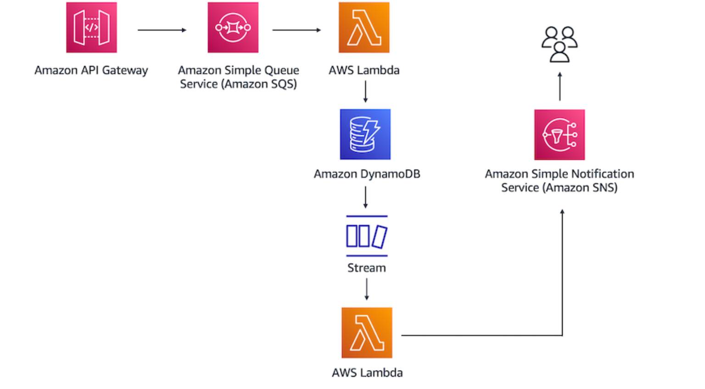

# Proof of Concept for a Serverless Solution

In this architecture, i used a REST API to place a database entry in the Amazon SQS queue. Amazon SQS will then invoke the first Lambda function, which inserts the entry into a DynamoDB table. After that, DynamoDB Streams will capture a record of the new entry in a database and invoke a second Lambda function. The function will pass the database entry to Amazon SNS. After Amazon SNS processes the new record, it will send you a notification through a specified email address.

# **Architectural Diagram**

